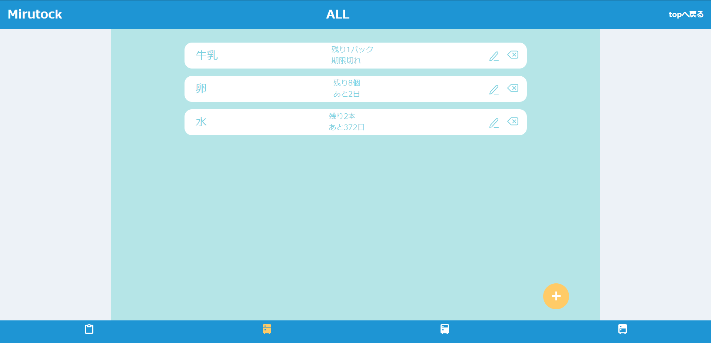

# Mirutock

「ストレスフリーな食材管理を実現します。」をコンセプトとした食材管理アプリです。
ログインなしで閲覧可能ですので、お気軽にご覧ください！

URL: https://mirutock.click/

### メインページ

## 使用技術

- フロントエンド
  - HTML/CSS
  - JavaScript
  - W3C Validator / Prettier (コード解析ツール)
- バックエンド
  - PHP 8.3
  - Laravel 10.48.10
  - MySQL 8.0
  - PHP_CodeSniffer (静的解析ツール)
- インフラ・開発環境
  - Docker/Docker-compose
  - AWS
    - VPC
    - Route53
    - ACM
    - ALB
    - ECS
    - ECR
    - RDS
  - Github Actions (CD)

## ER 図

## インフラ構成図

## 機能一覧

- 食材のデータ登録機能
- 食材データの詳細情報閲覧機能
- 各食材データの編集、削除機能
- 食材の絞り込み表示(全体、冷蔵食材、冷凍食材で絞り込み)
- 買い物リストの作成機能
- 買い物リストの編集による、食材データへの更新機能
- 買い物リストの削除機能

## 工夫点

- フロントエンド
  - 直感的に操作できるような Web デザイン
  - レスポンシブ対応
- バックエンド
  - 扱うデータによってコントローラを分割して、ソースコードの可読性を意識した点
  - バリデーションを設定し、ユーザの誤入力を抑止
- インフラ
  - 開発環境に Docker を使用
  - ECR、ECS(FARGATE)で本番環境をサーバーレスに運用
  - AWS を使用し、ALB を通すことで常時 SSL 通信を行う
  - GitHub Actions を使用した CD(Continuous Deployment)の構築
- その他
  - フロントエンドでは Prettier、バックエンドでは PHP_CodeSniffer でそれぞれのコード解析ツールを採用し、読みやすいコードを意識
  - チーム開発を意識した、ブランチやプルリクエストを活用した開発手法
